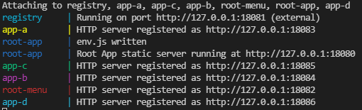
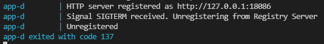
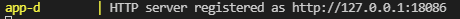

# Microfrontend Containers

> A POC that simulate an agnostic view render micro frontend using containers that run a static http-server inside. 

This approach fits on projects where there are several teams working on separated modules and they don't need to compose fragmented views like [this](https://micro-frontends.org/).
This project doesn't aim to explain the entire CI/CD cycle so the frontend build is part of Docker container image build.

Feel free to ask and make PR's 👍

## Prerequisites
* Docker
* Docker compose 1.2 +

> P.S Tested only on a Windows 10 machine

## Services
* app-a: A pure ES6 with babel WebComponent;
* app-b: A pure ES6 with babel WebComponent (yes, again);
* app-c: A Angular 6 made WebComponent;
* app-d: A React 17 made WebComponent;
* registry: Rest API where these apps above can register and unregister itself;
* root-app: The index. This app instantiates the root-menu and makes requests to the registry server and http-servers;
* root-menu: Receive the routes list, render it and dispatch events when the User click some link.

## Running
```
$ docker-compose up
```
> It will take a long time on the first run depending on your internet connection and your pc processing availability.

If all goes well you should have this on your terminal:




## So?
After You get all containers up You shall be able to access the URL http://127.0.0.1:18080 in your browser and:
1. root-app will initialize;
2. root-app asks registry service to the list of apps (You can check the list here http://127.0.0.1:18081);
3. root-app will instantiate the root-menu and pass the apps list through the 'routes' attribute;
4. root-menu will render the menu;
5. If You click some link root-app will download the app and append it to the body.

## Try this
1. On a separated terminal stop an app container ``docker stop app-d``
   
2. After this reopen your browser on the URL http://127.0.0.1:18080 (or just press F5 if it's already open);
   1. You shall see that the "App D" link is gone;
3. Start the container again ``docker start app-d``
   
4. Press F5 on your browser and now you can see the "App D" link back.

## Caveats
* It's intended to be just a POC so there is just one javascript file per container. It can be easily fixed setting a list of files (JS and CSS) in the app package.json and read this in the root-app through the registry service;
* It's a monorepo but doesn't have to be. So the static-server code is replicated on every app because each team should be able to build their own static http-server. It's useful for SSR server. Eventually they can share some common http-servers as a npm package.
